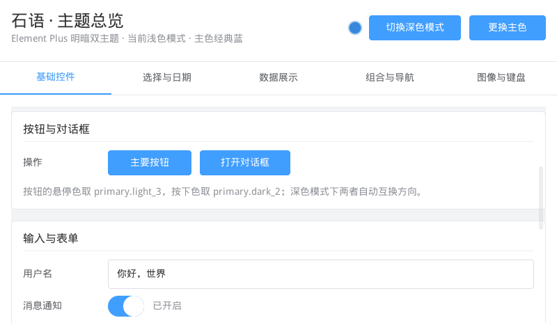
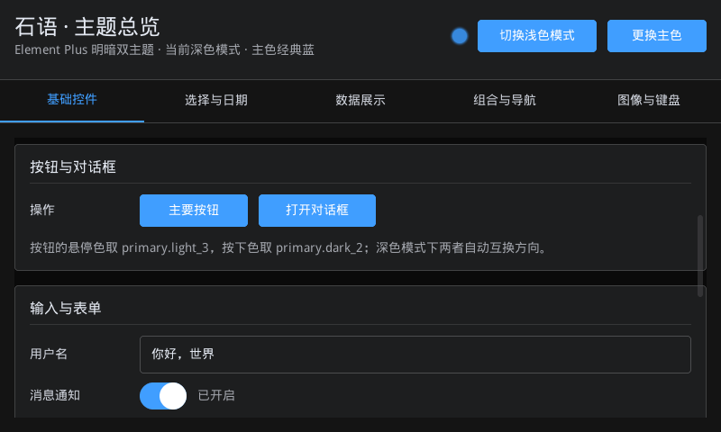
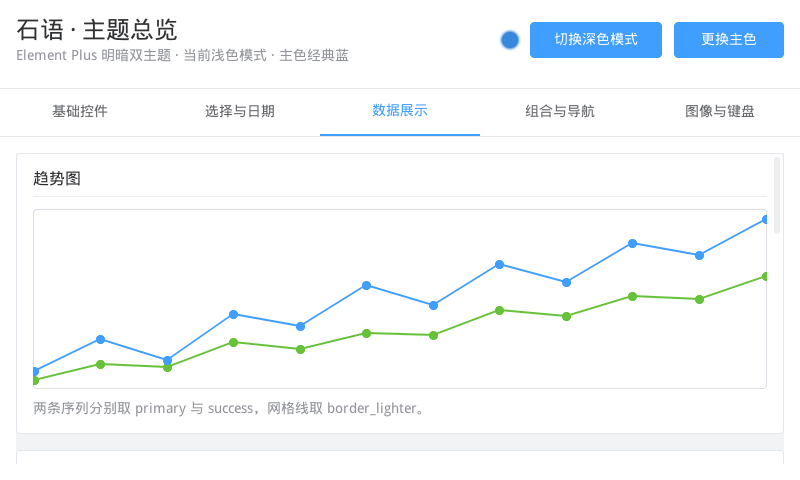
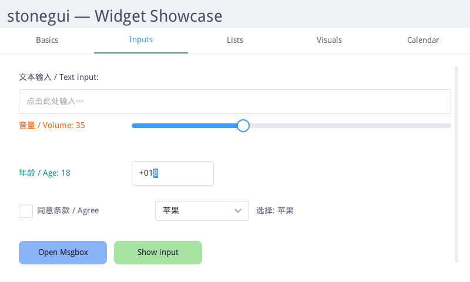

**English** | [简体中文](README.zh-CN.md)

# stonegui

A modern, declarative embedded GUI framework: **QuickJS + LVGL**, rendering
directly to native LVGL widgets — no XML, no HTML, no serialized UI tree.

You write React-Native-style components in JavaScript; the renderer maps them
straight to LVGL API calls.

```js
h("Text", { text: () => `Count: ${count()}` })
//                         ↓ on signal change
// lv_label_set_text(...)      // a single property update, not a remount
```

See [`doc/prompts.md`](doc/prompts.md) for the original (and partly stale)
design vision; the rest of this README reflects what currently ships.

## Screenshots

`examples/showcase` — the same screen in both schemes. `setTheme("dark")`
rebuilds the shared styles in place and repaints every widget; nothing is
remounted and inline styles survive.

| Light | Dark |
| --- | --- |
|  |  |

| Charts and data widgets | `examples/jsx` — the same API through real JSX |
| --- | --- |
|  |  |

## Architecture

```text
Application (examples/*)
    ↓
framework.js          fine-grained reactivity (signals + effects + owners)
    ↓  HostRenderer API (createNode / appendChild / setProperty / addEvent / dispose)
lv_bindings.c         native "lvgl" QuickJS module
    ↓
LVGL                  widgets, layout, styles, events, rendering, animation
    ↓
SDL2 (Linux/X11)
```

* **`js/framework.js`** — framework-agnostic reactive core. The component tree
  is built **once**; reactive prop values (thunks) each own their own effect,
  so a signal change updates a single LVGL property without remount. Owner
  tree drives `dispose()` for `<Show>` / `<For>` / hot teardown.
* **`src/lv_bindings.c`** — minimal `HostRenderer` surface exposed to JS as
  the native `lvgl` module.
* **`src/main.c`** — host: boots LVGL + SDL2, the QuickJS runtime (with the
  ES module loader), wires SIGINT/SIGTERM/SDL_QUIT clean shutdown, loads the
  bundle, runs the event loop.

## Build & run

Requires CMake (≥ 3.16), a C/C++ toolchain, and SDL2 (`pkg-config sdl2`).
LVGL **9.2.2** and QuickJS **2025-09-13** are fetched from GitHub via CMake
`FetchContent` on first configure (~60–120 s); no `git submodule` needed.

```sh
cmake -S . -B build
cmake --build build
./build/stonegui                       # runs examples/showcase/app.js
./build/stonegui examples/jsx/app.js   # or pass a bundle explicitly
```

The build copies `js/` and `examples/` next to the binary so relative imports
resolve at runtime. Override dep sources with
`-DSTONEGUI_LVGL_SOURCE_DIR=/path` or `-DSTONEGUI_QUICKJS_SOURCE_DIR=/path`
for offline work or upstream hacking.

Press `Ctrl+C` or close the window to exit cleanly (`lv_deinit` →
`JS_FreeRuntime` → `SDL_Quit`, exit code `128+signo`).

There is no CI and no regression runner. Check a change by running the
bundles yourself from the repository root:

```sh
./build/stonegui --no-watch examples/test/app.js   # 537 assertions, exit 0
STONEGUI_SHOWCASE_SMOKE=1 ./build/stonegui --no-watch examples/showcase/app.js
npx -y -p typescript@5 tsc --strict --target ES2020 --lib ES2020,DOM \
    --noEmit js/framework.d.ts                     # declarations type-check
```

The assertion bundle prints `ALL TESTS PASSED`; the showcase smoke prints
`SHOWCASE SMOKE PASSED`. The interactive `jsx` / `showcase` bundles have no
exit condition — run them under `timeout` and treat status 143 as success.

## Components (host tags)

31 lowercase JSX host tags map to LVGL widgets. Capitalised aliases also work.
See [`js/framework.d.ts`](js/framework.d.ts) and
[`HOST_TAGS`](js/framework.js) for the authoritative list.

| Tag (JSX)      | LVGL widget         | Notes                                  |
| -------------- | ------------------- | -------------------------------------- |
| `view`         | `lv_obj`            | Transparent layout container           |
| `text`         | `lv_label`          | Plain text                             |
| `button`       | `lv_button`         | Themed button, inline child label      |
| `image`        | `lv_image`          | PNG / JPG / BMP via bundled decoders   |
| `input`        | `lv_textarea`       | Single- or multi-line, CJK IME aware   |
| `switch`       | `lv_switch`         | On/off pill                            |
| `progress`     | `lv_bar`            | Determinate progress bar               |
| `slider`       | `lv_slider`         | Draggable bar with thumb               |
| `arc`          | `lv_arc`            | Circular slider / progress             |
| `spinner`      | `lv_spinner`        | Looping arc indicator                  |
| `checkbox`     | `lv_checkbox`       | Square check + inline text             |
| `dropdown`     | `lv_dropdown`       | Pop-up list, `options="a\nb\nc"`       |
| `roller`       | `lv_roller`         | Wheel-style selector                   |
| `tabview`      | `lv_tabview`        | With `<tab title="...">` children      |
| `tab`          | `lv_tab` (internal) | Tabview page                           |
| `list`         | `lv_list`           | With `<listButton text="...">` items   |
| `listButton`   | (internal)          | List row                               |
| `spinbox`      | `lv_spinbox`        | Numeric stepper; type digits or `↑`/`↓` |
| `led`          | `lv_led`            | Coloured indicator                     |
| `chart`        | `lv_chart`          | Line / bar / scatter; series via `ref` |
| `buttonMatrix` | `lv_buttonmatrix`   | Grid of buttons, `"\n"` row separators |
| `calendar`     | `lv_calendar`       | Date picker with month nav             |
| `scale`        | `lv_scale`          | Tick / label scale                     |
| `span`         | `lv_spangroup`      | Rich text (per-span color / size)      |
| `line`         | `lv_line`           | Polyline from `points={[[x,y],...]}`   |
| `table`        | `lv_table`          | Grid: `rows`/`cols` + `cells={[[…]]}`  |
| `menu`         | `lv_menu`           | Multi-page menu container              |
| `menuPage`     | (internal)          | Menu page; first one auto-activates    |
| `keyboard`     | `lv_keyboard`       | On-screen keyboard, `target={inputRef}` |
| `animimg`      | `lv_animimg`        | Multi-frame image loop (PNG/JPG/BMP)   |
| `imagebutton`  | `lv_imagebutton`    | Per-state image button (released/pressed/checked) |

`View` is a transparent, borderless, zero-padding layout box (React-Native
semantics) — set `backgroundColor`, `borderRadius`, `padding` etc. explicitly
when you want decoration.

## Reactivity

```js
import {
    createSignal, createEffect, createMemo, createRoot,
    onCleanup, untrack, batch,
} from "./js/framework.js";

const [count, setCount] = createSignal(0);
const doubled = createMemo(() => count() * 2);

createEffect(() => {
    console.log("count =", count(), "doubled =", doubled());
    onCleanup(() => console.log("effect torn down"));
});

batch(() => { setCount(1); setCount(2); });   // one effect run, not two
untrack(() => count());                       // read without subscribing
```

Owners form a tree: every effect runs inside an owner; disposing an owner
runs its `onCleanup` callbacks and recursively disposes its children. The
function returned by `render()` is the root dispose.

## Dynamic UI: `<Show>` / `<For>`

```jsx
import { Show, For } from "./js/framework.js";

<Show when={visible}>{() => <Header />}</Show>
<Show when={() => loading()} fallback={() => <Empty />}>
    {() => <List items={items} />}
</Show>

<For each={items} key={(item) => item.id}>
    {(item, index) => <Row data={item} index={index} />}
</For>
```

* `<For>` is **keyed** — existing items keep their state across re-renders;
  only added/removed items mount/unmount. Children must be a render function
  `(item, index) => VNode`.
* `<Show>` children should be a function `() => VNode` when you want a fresh
  component instance (and per-mount `onCleanup`) on every toggle. Static
  VNode children also work but are not re-evaluated.

## Images (`<image>`, `<animimg>`, `<imagebutton>`)

LVGL's bundled `lodepng`, `tjpgd`, and BMP decoders are enabled — zero system
dependencies for PNG / JPG / BMP. The POSIX filesystem driver is registered
on letter `A:`, so absolute file paths look like:

```jsx
<image src="A:/abs/path/to/picture.png" style={{ width: 128, height: 128 }} />
```

### `loadImage` — reusable handles

For images you reference more than once, in `<animimg>` arrays, or per
`<imagebutton>` state, prefer the handle form:

```js
import { loadImage, loadImages } from "./js/framework.js";

const logo   = loadImage("/abs/path/logo.png");       // 0 if file missing
const frames = loadImages([                            // batch
    "/abs/path/frame1.png",
    "/abs/path/frame2.png",
    "/abs/path/frame3.png",
]);
```

Bundles should locate their own assets with `moduleDir(import.meta.url)`
rather than an absolute path — the binary resolves relative imports against
its CWD, but `moduleDir` returns the bundle's real directory either way:

```js
import { moduleDir, loadImage } from "../../js/framework.js";
const ASSETS = moduleDir(import.meta.url);
const logo   = loadImage(`${ASSETS}/logo.png`);
```

`loadImage` validates the file with `fopen`, auto-prepends the `A:` prefix
if you pass a `/`-absolute path, and returns an opaque integer handle (just
like `loadFont`). Handles live for the lifetime of the runtime — they are
intentionally never freed (LVGL caches the decoded image keyed on the path).

`<image src>` accepts both forms:

```jsx
<image src={logo} style={{ width: 64, height: 64 }} />     {/* handle */}
<image src="A:/abs/path/icon.png" style={{ width: 32 }} /> {/* string */}
```

### `<animimg>` — multi-frame loop

```jsx
<animimg
    src={frames}
    duration={900}             /* one full cycle, ms */
    repeat="infinite"          /* or a finite count */
    start={true}
    style={{ width: 128, height: 128 }}
/>
```

### `<imagebutton>` — per-state PNG button

```jsx
const released = loadImage("/abs/path/btn-normal.png");
const pressed  = loadImage("/abs/path/btn-pressed.png");

<imagebutton
    released={released}
    pressed={pressed}
    checkable={false}          /* set true so clicks toggle to checked state */
    style={{ width: 128, height: 128 }}
    onClick={() => console.log("click")}
/>
```

Six state props accept handles or strings: `released`, `pressed`,
`disabled`, `checkedReleased`, `checkedPressed`, `checkedDisabled`.
Stonegui binds the solid-image variant — the LVGL 9-patch 3-tile API is
not exposed (no `*_mid` / `*_right` props).

The image family (static `<image>`, `<animimg>` loop, per-state
`<imagebutton>`) is demonstrated in the showcase's "图像家族" card:

```sh
./build/stonegui examples/showcase/app.js       # see the "图像家族" media card
```

Refresh the test assets with the adjacent `make_*.py` scripts in
`examples/showcase/assets/` (Python stdlib only — they pull 72×72 PNGs from
the [Twemoji](https://github.com/twitter/twemoji) CDN). Twemoji graphics are
CC-BY 4.0 © Twitter Inc and other contributors.

## Pseudo-state styles

```jsx
<button style={{
    width: 120, height: 40, borderRadius: 8,
    backgroundColor: "#3498db",
    hover:    { backgroundColor: "#5dade2" },
    pressed:  { backgroundColor: "#2980b9" },
    focus:    { borderWidth: 2, borderColor: "#ffffff" },
    disabled: { backgroundColor: "#7f8c8d" },
}}>Click me</button>
```

Pseudo-state objects nest inside `style`; their entries apply with the
matching LVGL state selector. Supported states are `default`, `hover`,
`focus`, `pressed`, `checked` and `disabled`. Nesting is exactly one level
deep: a style object inside a state object throws a `TypeError`.

## Part styles

Sub-parts of a widget are styled through `partStyles`, keyed by part name:

```jsx
<slider style={{
    partStyles: {
        indicator: { backgroundColor: "$primary.base" },
        knob:      { backgroundColor: "$white", pressed: { backgroundColor: "$fill_dark" } },
    },
}} />
```

Supported parts: `main`, `scrollbar`, `indicator`, `knob`, `selected`,
`items`, `cursor`, `placeholder`. Each part accepts the same base values as
`style` plus one level of pseudo-state nesting. An unknown part name throws
a `TypeError` at mount.

`partStyles` is unrelated to `<span parts={…}>`, which describes styled text
runs inside one span widget.

## Imperative escape hatches (charts, msgbox)

Two things do not fit the mount-once declarative tree and are driven through
function calls instead. Chart series are created from a `ref` callback:

```jsx
import { chartAddSeries, chartSetSeriesColor, chartSetData } from "./js/framework.js";

<chart
    style={{ width: 300, height: 180 }}
    ref={(node) => {
        const series = chartAddSeries(node, "#409EFF");
        chartSetData(node, series, [10, 40, 25, 70, 55]);
        chartSetSeriesColor(node, series, "#67C23A");   // recolour later
    }}
/>
```

`chartSetData` replaces the whole point array. These three take a literal
colour (`#rrggbb` or a named colour) — they are **not** style properties, so
a `"$token"` reference does not resolve here. To make a series follow the
theme, read the token off the native module first:

```js
import * as lv from "lvgl";
chartSetSeriesColor(node, series, lv.getThemeToken("primary.base"));
```

`getThemeToken` / `getThemeMetric` live on the `"lvgl"` module rather than on
`framework.js`. `chartSetSeriesColor` exists because `lv_chart_add_series`
copies the colour into the series struct, so a later theme change cannot
reach a series that already exists.

A modal is opened on demand — there is no declarative form, because it has no
place in a tree that mounts once:

```js
import { showMsgbox } from "./js/framework.js";

showMsgbox(
    { title: "确认", text: "要删除这一项吗？", buttons: ["取消", "删除"] },
    (index) => console.log("clicked", index),   // onClose is optional
);
```

`onClose` receives the 0-based index of the button that was pressed, or `-1`
when the msgbox was dismissed through its close button.

## Animations

```js
import { createAnimation } from "./js/framework.js";

createAnimation(node, {
    property:   "width",      // x|y|width|height|opacity|rotation|scale|value
    from:       100,
    to:         250,
    duration:   200,          // ms
    easing:     "ease-out",   // linear|ease-in|ease-out|ease-in-out|overshoot|bounce|step
    delay:      0,            // ms
    repeat:     1,            // int or "infinite"
    onComplete: () => {},
});
```

LVGL's `lv_anim` engine drives the property; `onComplete` fires when the
animation finishes (or after every loop when repeating).

## Theme (Element Plus)

stonegui ships a self-contained Element Plus theme. It is installed with
`parent = NULL`, so stonegui owns every one of LVGL's ten theme slots and
nothing is inherited from LVGL's default theme. Every visible rule (colour,
radius, spacing, stroke, elevation, typography) comes from stonegui's own
token set; your inline `style={…}` always wins over it.

Switch scheme or patch a single token at runtime:

```js
import { setTheme, setThemeToken } from "./js/framework.js";

setTheme("dark");                          // full dark mode
setTheme("light");                         // back to light
setThemeToken("primary.base", "#e74c3c");  // colour token takes a colour
setThemeToken("radius_base", 8);           // integer token takes a number
```

Tokens are typed. Colour tokens are the six semantic ramps
(`primary` / `success` / `warning` / `danger` (alias `error`) / `info`, each
with `.base`, `.light_3`, `.light_5`, `.light_7`, `.light_9`, `.dark_2`) plus
the neutral roles (`text_primary`, `text_regular`, `text_secondary`,
`text_placeholder`, `text_disabled`, the `border_*` / `fill_*` / `bg_*`
families, `overlay_mask`, `white`, `black`). Integer tokens are the metrics
(`radius_base`, `radius_small`, `radius_round`, `border_width`, `space_xs`…
`space_xl`, `control_height`, `slider_track_size`, `slider_knob_size`,
`arc_width`, `scrollbar_size`, `shadow_small_width`, `shadow_overlay_width`,
`shadow_opa`, `disabled_opa`, `overlay_mask_opa`, `btn_pad_hor`,
`btn_pad_ver`, `radius_btn`, `radius_field`). The older flat names
(`primary`, `primary_dark`, `on_primary`, `secondary`, `bg`, `surface`,
`on_surface`, `on_variant`, `outline`, `track`, `danger`, `warning`) still
work as aliases of the canonical roles. `doc/theme.md` is the authoritative
list with exact hex values.

`control_height` is the one metric that is registered and settable but that
no theme style currently consumes — patching it type-checks and succeeds, yet
repaints nothing. Widget heights come from LVGL's own content sizing today.

An unknown token name, or a value of the wrong kind (a number for a colour
token, a colour for an integer token), throws a `TypeError`. The full set is
also declared in `js/framework.d.ts`, so the mismatch is a compile error in
a TS-aware editor.

### Live token references in `style`

`backgroundColor`, `borderColor` and `textColor` accept a `"$token"` string
that resolves against the live theme and re-resolves on every `setTheme` /
`setThemeToken`:

```jsx
<view style={{ backgroundColor: "$bg_base", textColor: "$text_primary" }} />
```

Only those three properties resolve references; anywhere else a `$…` string
stays a literal. Only colour tokens can be referenced, and a name that is not
a colour token throws a `TypeError` when the style is applied.

`setTheme` / `setThemeToken` both rebuild the shared styles in place and call
`lv_obj_report_style_change(NULL)` — every widget repaints, nothing is
remounted, and your local styles survive. On a 200-widget screen this takes
~1-2 ms; it is intended for theme toggle, not per-frame animation.

### Reading resolved styles

`getProperty(node, key, selector?)` reports what the theme plus your inline
styles actually resolved to, for any part/state combination:

```js
import { getProperty } from "./js/framework.js";

getProperty(slider, "backgroundColor", { part: "knob" });
getProperty(button, "backgroundColor", { state: "disabled" });
```

Selector parts are the `partStyles` parts; selector states are the pseudo
states plus the read-only `focusKey`, `edited` and `scrolled`. An unknown
key, part or state throws a `TypeError` instead of silently returning black.

## Hot reload

By default the binary watches the bundle's parent directory and re-runs the
bundle on every save (`IN_CLOSE_WRITE | IN_MOVED_TO | IN_MODIFY`). On reload:
all LVGL widgets are torn down, the QuickJS runtime is freed and recreated,
the bundle re-executes from the top. LVGL state (window, theme, input
devices, focus group) persists; JS state (signals, `loadFont` handles,
animations) does not — re-initialise it in the bundle's top level.

Disable with `--no-watch` (also what the smoke-test loop uses).

## CJK font auto-discovery

`setDefaultFont()` with no argument auto-discovers the first installed CJK
font from a built-in candidate list and loads it at the four typography role
sizes 14 / 16 / 20 / 24 px:

```js
import { setDefaultFont, findCjkFont, loadFontSizes } from "./js/framework.js";

setDefaultFont();               // zero-config — auto-discovers CJK at 14/16/20/24

const path = findCjkFont();     // returns path string or null
const fonts = loadFontSizes(path, [14, 16, 20, 24]);  // {14: h, 16: h, 20: h, 24: h}
                                // a size that fails to load is omitted, not 0
setDefaultFont(fonts);          // or pass a partial map: { 14: h, 20: h }
```

If no CJK font is installed, `setDefaultFont()` is a no-op and text falls
back to the built-in Latin-only Montserrat face.

Font handles are cached per `(path, size)` and the decoded file bytes are
shared by path, so loading four sizes of one file reads it once. Tiny-TTF
keeps that buffer by reference, so neither the bytes nor the font objects are
ever freed.

Candidate paths probed in order:
1. `/usr/share/fonts/truetype/wqy/wqy-microhei.ttc`
2. `/usr/share/fonts/opentype/noto/NotoSansCJK-Regular.ttc`
3. `/usr/share/fonts/truetype/noto/NotoSansCJK-Regular.ttc`
4. `/System/Library/Fonts/PingFang.ttc`
5. `C:/Windows/Fonts/msyh.ttc`

## Fonts & internationalization (CJK / Chinese)

The built-in Montserrat font is Latin-only. To render Chinese (or any other
script) load a TTF/TTC at runtime. The recommended pattern is a **global
default font**, overriding per-element only when you need a different
size/face:

```js
import { loadFont, setDefaultFont } from "./js/framework.js";

const body  = loadFont("/usr/share/fonts/truetype/wqy/wqy-microhei.ttc", 20);
const title = loadFont("/usr/share/fonts/truetype/wqy/wqy-microhei.ttc", 30);

setDefaultFont(body);                                   // global default
h("Text", { text: "你好，世界" });                       // inherits `body`
h("Text", { style: { font: title }, text: "标题" });    // explicit override
```

* `loadFont(path, size)` reads the file into memory and builds a Tiny-TTF
  font; returns `0` if the file can't be opened. Text is UTF-8.
* CJK fonts automatically fall back to the matching Montserrat for
  `LV_SYMBOL_*` glyphs (checkbox tick, dropdown arrow); without that
  fallback you'd see tofu for the symbols.
* Tiny-TTF fonts are a fixed pixel size per handle — load one handle per
  size you need. (`fontSize: 14|16|20|24` selects the built-in Latin
  Montserrat sizes.)

### Emoji are not supported

**Emoji are not supported and render as tofu boxes.** This is a property of
the text stack, not a missing font: Tiny-TTF's `stb_truetype` backend reads
only `glyf`/`CFF` outlines and has no support for the `CBDT`/`COLR`/`sbix`
colour-glyph tables that every emoji font uses, so loading e.g.
`NotoColorEmoji.ttf` changes nothing. LVGL's own answer is `LV_USE_IMGFONT`
(one image per codepoint), which this build leaves off. CJK text, CJK
punctuation and `LV_SYMBOL_*` glyphs are unaffected.

## Input field props

All props may be reactive (`() => signal()`).

| Prop | Type | Description |
|---|---|---|
| `text` | string | The field's content |
| `placeholder` | string | Ghost text when empty |
| `oneLine` | boolean | Single-line mode |
| `maxLength` | number | Max character count (0 = unlimited) |
| `acceptedChars` | string | Allowed chars, e.g. `"0123456789"` |
| `password` | boolean | Mask text with bullets |
| `align` | `"left"` \| `"center"` \| `"right"` | Text alignment |
| `textSelection` | boolean | Enable mouse/touch text selection |
| `cursorPos` | number | Set cursor position (get via `getProperty(ref, "cursorPos")`) |

Clipboard is exposed via:
```js
import { clipboard } from "./js/framework.js";
clipboard.write("text");
const s = clipboard.read();   // returns string or null
```

Ctrl+A/C/V/X and Home/End work automatically in any focused `<input>`.

Focus and key injection are scriptable, which is how the shortcut round-trip
is regression-tested:

```js
import { focus, sendKey } from "./js/framework.js";

focus(inputRef);            // lv_group_focus_obj
sendKey("c", true);         // Ctrl+C into the focused widget
sendKey("end");             // Home / End also supported
```

## Keyboard input

A global focus group is wired to the keyboard device. Interactive widgets
(`Input`, `Button`, `Switch`, `Slider`, `Arc`, `Checkbox`, `Dropdown`,
`Roller`, `Spinbox`, `ButtonMatrix`, `Calendar`) are added automatically, so
you can click an `Input` to focus it and then type, or `Tab` between widgets.

ASCII and multi-byte **UTF-8 (CJK) input** both work: the host installs a
UTF-8-aware keyboard read callback that delivers one whole character per
keypress (LVGL's default SDL driver otherwise splits multi-byte characters
and corrupts them).

To compose Chinese you still need a system **IME** (e.g. fcitx5 or ibus)
running. Each `Input` reports its on-screen rectangle to SDL when focused,
so the IME's candidate window follows the input box. The host re-arms SDL's
text input after the window exists, because `lv_sdl_window_create()` calls
`SDL_StartTextInput()` before there is a window for the X11 backend to bind
the IME's input context to — without that, plain typing still works but an
IME's composed text never arrives.

`<spinbox>` accepts typed digits: a digit overwrites the digit under the
cursor and the cursor moves one place right, so the configured digit format
is preserved. Click a digit (or use `←`/`→`) to choose where to type; `↑`/`↓`
step the selected digit.

## Mouse wheel

The wheel scrolls the innermost scrollable container **under the pointer**,
and hands the gesture to the next scrollable ancestor once that container
reaches its end — so a list inside a scrolling page behaves the way it does
in a browser. LVGL's own SDL wheel driver is an encoder that drives the focus
group instead, which would scroll whatever is focused rather than what the
cursor is over; the host resolves the target geometrically instead.

## Window title

```js
import { setWindowTitle } from "./js/framework.js";
setWindowTitle("My App");        // default without this call: "LVGL Simulator"
```

Returns `false` if there is no display yet. One caveat on X11: a **non-ASCII**
title only reliably reaches `WM_NAME`. SDL sets `_NET_WM_NAME` — the property
modern window managers actually display — through
`Xutf8TextListToTextProperty`, which needs a locale Xlib supports; the common
`LANG=C.UTF-8` is *not* one of them, so the titlebar keeps the old text while
`WM_NAME` updates. Use an ASCII title, or run under a real UTF-8 locale such
as `en_US.UTF-8`.

## TypeScript support

[`js/framework.d.ts`](js/framework.d.ts) ships full type declarations for
the public API + JSX intrinsics + per-widget props + pseudo-state and part
styles + typed theme tokens. VS Code and other LSP editors pick it up
automatically for `.js` and `.jsx` files — no `tsconfig.json` required.

Colour and integer theme tokens are separate unions, so `setThemeToken` is a
compile error when the value kind does not match the name. Resolved-style
getters are keyed too: `getProperty(node, "backgroundColor")` is a colour
string, `getProperty(node, "radius")` is a number. There is no CI — type-check
the declarations by hand after every `framework.d.ts` edit:

```sh
npx -y -p typescript@5 tsc --strict --target ES2020 --lib ES2020,DOM \
    --noEmit js/framework.d.ts
```

## Examples

| Path                  | What it shows                                    |
| --------------------- | ------------------------------------------------ |
| `examples/showcase`   | **The core demo** — all 31 host tags, light/dark themes + runtime tokens, CJK role fonts, image family, on-screen keyboard, chart/menu/msgbox, animation engine. Interactive by default; `STONEGUI_SHOWCASE_SMOKE=1` runs the scripted regression |
| `examples/jsx`        | JSX + esbuild toolchain — widget showcase via real JSX (transpiled) |
| `examples/test`       | Framework / theme / layout / input / keyboard — 537 assertions |

### `examples/jsx` — JSX (React/Vue style)

Real JSX, transpiled to plain JS with esbuild (QuickJS can't parse JSX
itself).

```sh
cd examples/jsx
npm install        # once — installs esbuild (dev dependency)
npm run build      # app.jsx → app.js  (or: npm run watch)
cd ../..
./build/stonegui examples/jsx/app.js
```

`node_modules/` and `package-lock.json` are gitignored — `app.js` is
committed so the demo runs without installing anything; you only need
`npm install` to rebuild after editing `app.jsx`.

## Status

Linux/X11 only, on LVGL 9.2.2 + QuickJS + SDL2. Everything above this section
is implemented and exercised by `examples/showcase`.

**Not supported:** colour emoji — the Tiny-TTF text stack cannot decode
colour-glyph tables, so emoji render as tofu regardless of the font
installed (see [Emoji are not supported](#emoji-are-not-supported)).

**No automated gates.** There is no CI, formatter, linter or regression
runner — `.github/`, `scripts/` and `tools/` were all removed deliberately.
Correctness rests on running `examples/test` (537 assertions) and the
showcase smoke bundle by hand; nothing checks theme token-registry drift or
the hex values in `doc/theme.md` any more.

**Planned:** Wayland backend, framework adapters (Solid/Preact), atom-interned
`js_setProperty`, DevTools / signal inspector, remaining LVGL widgets
(`canvas`, `tileview`, `win`).
